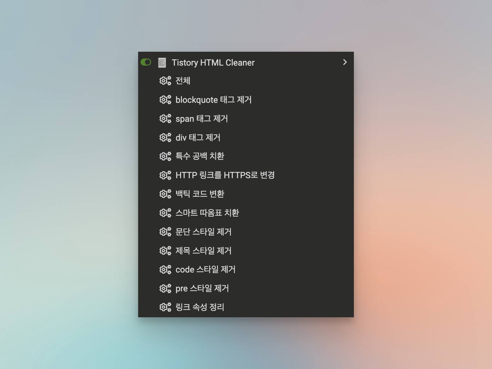

# Tistory HTML Cleaner

> 티스토리 에디터의 HTML을 정리하는 Tampermonkey userscript

## 설치 방법

1. [Tampermonkey](https://www.tampermonkey.net/) 브라우저 확장 프로그램을 설치합니다.
2. [설치 링크](https://romantech.github.io/tistory-html-cleaner/tistory-html-cleaner.user.js)를 열어 userscript를 설치합니다.

## 사용 방법

1. 티스토리 글쓰기 화면으로 이동합니다.
2. 브라우저 도구 모음에서 Tampermonkey 아이콘을 클릭합니다.
3. 메뉴에서 원하는 정리 항목을 선택합니다.

## 정리 항목

- `blockquote`, `span`, `div` 태그 제거 (내용 유지)
- 특수 공백 치환, HTTP 링크의 HTTPS 전환
- 백틱 코드 변환, 스마트 따옴표 치환
- 문단, 제목, `code`, `pre`의 인라인 스타일 제거
- 링크의 불필요한 속성 제거 및 외부 링크 보안 속성 추가

`전체 정리`를 실행하면 `blockquote` 태그 제거를 제외한 모든 항목을 적용합니다.
